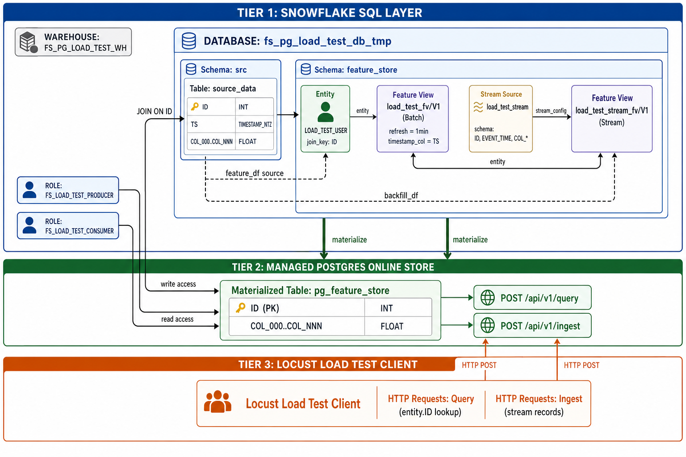

# Feature Store Load Test Suite

A unified load testing framework for measuring online feature store query performance on both **Snowflake** and **Databricks** platforms.

## What It Measures

- **Latency percentiles**: P50, P90, P95, P99, P99.9 response times
- **Throughput**: Achieved queries per second (QPS) under load
- **Success rate**: Percentage of requests that return successfully
- **Scaling behaviour**: How latency degrades as QPS, batch size, or feature width increases

## Architecture

The diagram below shows the Snowflake Feature Store Postgres architecture used by this load test:



### Snowflake (3-Tier Architecture)

| Tier | Component | Role |
|------|-----------|------|
| **Tier 1** | Snowflake SQL Layer | Warehouse (`FS_PG_LOAD_TEST_WH_*`), database (`fs_pg_load_test_db_tmp`), source data table, Entity, batch/stream Feature Views |
| **Tier 2** | Managed Postgres Online Store | Materialized table (`pg_feature_store`) with REST APIs: `POST /api/v1/query` and `POST /api/v1/ingest` |
| **Tier 3** | Locust Load Test Client | Generates HTTP POST requests for query (entity ID lookups) and ingest (stream records) |

In **SQL mode**, the load test bypasses Tier 2 and queries a Dynamic Table directly via a Snowpark session.

### Databricks (Equivalent Architecture)

| Snowflake Component | Databricks Equivalent |
|--------------------|-----------------------|
| Warehouse | SQL Warehouse (for SQL mode) |
| Feature View + Online Service | Online Store (Lakebase) + Feature Serving Endpoint |
| `POST /api/v1/query` | `POST /serving-endpoints/{name}/invocations` |
| Dynamic Table (SQL mode) | Online Table queried via SQL Warehouse |
| Stream Source + Ingest API | N/A (Databricks uses `publish_table()` with CONTINUOUS mode) |

## Prerequisites

- Python 3.10+
- `pip install -r requirements.txt` (install only the packages for your target platform)
- Access to either a Snowflake account or Databricks workspace

## Setup

### Snowflake Setup

1. **Create a `.env` file** in the project root (or the directory where you run the tests):

```env
SNOWFLAKE_ACCOUNT=your_account_identifier
SNOWFLAKE_USER=your_username
SNOWFLAKE_PASSWORD=your_password
SNOWFLAKE_ROLE=ACCOUNTADMIN
SNOWFLAKE_HOST=your_account.snowflakecomputing.com
SNOWFLAKE_WAREHOUSE=COMPUTE_WH
SNOWFLAKE_DATABASE=your_database
SNOWFLAKE_SCHEMA=your_schema
SNOWFLAKE_PAT=your_programmatic_access_token
```

2. **Ensure your role has permissions** to:
   - Create databases, schemas, warehouses
   - Create and manage Feature Store objects (feature views, entities, online services)
   - The load test uses `ACCOUNTADMIN` by default for provisioning

3. **Generate a Programmatic Access Token (PAT)** in Snowsight:
   - Go to your user menu > Preferences > Programmatic Access Tokens
   - Create a token and set it as `SNOWFLAKE_PAT` in your `.env`
   - This token is used by Locust workers to authenticate REST API calls

4. **Install Snowflake dependencies**:

```bash
pip install snowflake-ml-python snowflake-snowpark-python locust python-dotenv requests matplotlib pandas
```

### Databricks Setup

1. **Create a `.env` file** in the project root:

```env
DATABRICKS_HOST=https://your-workspace.cloud.databricks.com
DATABRICKS_TOKEN=dapi_your_personal_access_token
DATABRICKS_CATALOG=your_catalog
DATABRICKS_SCHEMA=your_schema
DATABRICKS_ONLINE_STORE_NAME=your_online_store
DATABRICKS_SERVING_ENDPOINT=your_serving_endpoint
DATABRICKS_SQL_WAREHOUSE_HTTP_PATH=/sql/1.0/warehouses/your_warehouse_id
DATABRICKS_TLS_NO_VERIFY=false
```

2. **Pre-provision infrastructure** (required for local execution):
   - Create an Online Store (Lakebase instance) in your workspace
   - Create a feature table with the appropriate schema
   - Publish the feature table to the online store
   - Create a Feature Serving endpoint backed by a FeatureSpec
   - For SQL mode: ensure a SQL Warehouse is running and set `DATABRICKS_SQL_WAREHOUSE_HTTP_PATH`

3. **Install Databricks dependencies**:

```bash
pip install databricks-sdk databricks-sql-connector databricks-feature-engineering locust python-dotenv requests matplotlib pandas
```

## Usage

### Running Experiments

```bash
# Snowflake - REST mode (default)
python run_experiments.py --platform snowflake --config config/experiment_config.json

# Snowflake - SQL mode (queries Dynamic Table directly)
python run_experiments.py --platform snowflake --config config/experiment_config.json --query-mode SQL

# Databricks - REST mode (default)
python run_experiments.py --platform databricks --config config/experiment_config.json

# Databricks - SQL mode (SQL Warehouse queries)
python run_experiments.py --platform databricks --config config/experiment_config.json --query-mode SQL

# Dry run (either platform) - shows what would execute without running
python run_experiments.py --platform snowflake --config config/experiment_config.json --dry-run

# Run a specific series only
python run_experiments.py --platform snowflake --config config/experiment_config.json --series query_qps_scaling
```

### Command-Line Options

| Flag | Description | Platforms |
|------|-------------|-----------|
| `--platform` | Target platform: `snowflake` or `databricks` | Both (required) |
| `--config` | Path to experiment configuration JSON | Both (required) |
| `--query-mode` | `REST` (default) or `SQL` | Both |
| `--series` | Run only a specific series by name | Both |
| `--dry-run` | Show experiments without executing | Both |

## Configuration File Format

Experiments are defined in a JSON configuration file with three sections:

```json
{
  "system": {
    "duration": 180,
    "warmup": 900,
    "output_dir": "results",
    "users_multiplier": 8
  },
  "base_experiment_settings": {
    "qps": 200,
    "batch_size": 1,
    "num_columns": 100,
    "num_table_rows": 10000000,
    "num_entity_keys": 10000000,
    "task_type": "query"
  },
  "series": [
    {
      "name": "query_qps_scaling",
      "series_class": "QueryQpsSeries",
      "x_axis_parameter": "qps",
      "experiments": [
        {"qps": 10},
        {"qps": 50},
        {"qps": 100},
        {"qps": 200},
        {"qps": 500}
      ]
    }
  ]
}
```

### Configuration Fields

| Field | Description |
|-------|-------------|
| `system.duration` | Seconds of steady-state measurement (after warmup) |
| `system.warmup` | Seconds of ramp-up before stats collection begins |
| `system.users_multiplier` | Requests per second each Locust user sends |
| `system.output_dir` | Directory for results output |
| `base_experiment_settings` | Default parameters inherited by all experiments |
| `series[].name` | Unique identifier for the series |
| `series[].series_class` | Python class name that manages setup/teardown |
| `series[].x_axis_parameter` | Which parameter varies across experiments (for charts) |
| `series[].experiments` | List of parameter overrides for each experiment point |

## Generating Reports

After experiments complete, generate an HTML report:

```bash
python generate_report.py results/2024-01-15_14-30-00
```

This produces `final_report.html` in the results directory containing:
- Test summary with total requests and success rates
- Latency percentile charts (P50/P90/P95) for each series
- Success rate charts showing degradation under load
- Detailed results table with all metrics

Open the report in a browser:

```bash
open results/2024-01-15_14-30-00/final_report.html
```

## Series Classes Reference

### Snowflake Series (`series_snowflake.py`)

| Class | X-Axis | Description |
|-------|--------|-------------|
| `QueryQpsSeries` | `qps` | Scale queries per second against Query API |
| `QueryBatchSizeSeries` | `batch_size` | Scale entity keys per request |
| `QueryFeatureWidthSeries` | `num_columns` | Scale number of feature columns returned |
| `IngestQpsSeries` | `qps` | Scale ingest throughput via Stream Source |
| `MixedWorkloadSeries` | `qps` | Combined query + ingest under increasing load |

### Databricks Series (`series_databricks.py`)

| Class | X-Axis | Mode | Description |
|-------|--------|------|-------------|
| `QpsSeries` | `qps` | REST | Scale QPS against Feature Serving endpoint |
| `BatchSizeSeries` | `batch_size` | REST | Scale entities per request |
| `TableWidthSeries` | `num_columns` | REST | Scale feature columns requested |
| `CapacitySeries` | `online_store_capacity` | REST | Scale online store capacity (CU_1..CU_8) |
| `EndpointSizeSeries` | `endpoint_workload_size` | REST | Scale endpoint size (S/M/L) |
| `SqlQpsSeries` | `qps` | SQL | Scale QPS via SQL Warehouse |
| `SqlBatchSizeSeries` | `batch_size` | SQL | Scale IDs in WHERE clause |
| `SqlTableWidthSeries` | `num_columns` | SQL | Scale columns in SELECT |
| `SqlCapacitySeries` | `online_store_capacity` | SQL | Scale capacity via SQL |

## File Structure

```
main-load-test-combined/
  __init__.py               # Package marker
  run_experiments.py        # Unified CLI entry point
  experiment_config.py      # Config loading and validation
  locustfile.py             # Locust User class (both platforms)
  series_base.py            # Shared BaseSeries ABC
  series_snowflake.py       # Snowflake series classes
  series_databricks.py      # Databricks series classes
  generate_report.py        # HTML report generator
  README.md                 # This file
```

## Environment Variables

The load test uses environment variables (via `.env` file) for credentials and optional runtime overrides:

| Variable | Platform | Description |
|----------|----------|-------------|
| `SNOWFLAKE_ACCOUNT` | Snowflake | Account identifier |
| `SNOWFLAKE_USER` | Snowflake | Username |
| `SNOWFLAKE_PASSWORD` | Snowflake | Password |
| `SNOWFLAKE_ROLE` | Snowflake | Role (default: ACCOUNTADMIN) |
| `SNOWFLAKE_HOST` | Snowflake | Host URL |
| `SNOWFLAKE_WAREHOUSE` | Snowflake | Default warehouse |
| `SNOWFLAKE_DATABASE` | Snowflake | Database name |
| `SNOWFLAKE_SCHEMA` | Snowflake | Schema name |
| `SNOWFLAKE_PAT` | Snowflake | Programmatic Access Token for REST API |
| `DATABRICKS_HOST` | Databricks | Workspace URL |
| `DATABRICKS_TOKEN` | Databricks | Personal Access Token |
| `DATABRICKS_CATALOG` | Databricks | Unity Catalog name |
| `DATABRICKS_SCHEMA` | Databricks | Schema within catalog |
| `DATABRICKS_ONLINE_STORE_NAME` | Databricks | Lakebase online store name |
| `DATABRICKS_SERVING_ENDPOINT` | Databricks | Feature Serving endpoint name |
| `DATABRICKS_SQL_WAREHOUSE_HTTP_PATH` | Databricks | SQL Warehouse HTTP path (SQL mode) |
| `DATABRICKS_TLS_NO_VERIFY` | Databricks | Skip TLS verification (dev only) |
| `NUM_CORES` | Both | Override CPU core count for Locust processes |
