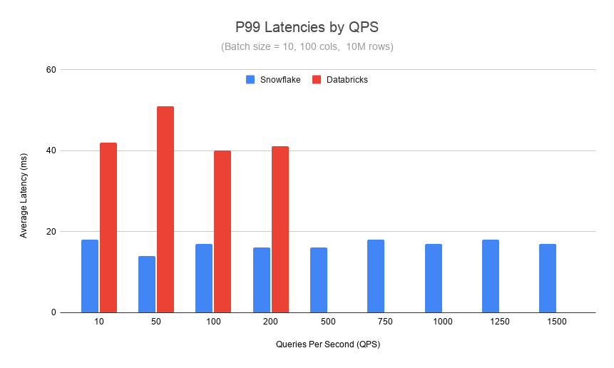

# Snowflake Feature Store — Online Serving Benchmark Kit

Reproducible benchmarks for Snowflake Feature Store online serving performance.

## Summary Results

> **Disclaimer:** Actual results may vary based on your workload, configuration, and region; comparisons are for illustration only and do not guarantee performance in any specific environment.

### Latency Benchmarks

#### Postgres-Backed (100K rows, 5 features, HIGHMEM_X64_S pool, single-threaded)

| p50 | p90 | p99 |
|--------|-----|-----|
| **10.9ms** | **12.5ms** | **16.3ms** |

#### Hybrid Table-Backed (100K rows, 10 features, SL pool, 8 threads)

| p50 | p95 | p99 |
|-----|-----|-----|
| **47.34ms** | **72.79ms** | **93.04ms** |

For detailed analysis, see [RESULTS.md](RESULTS.md).

### Snowflake vs Databricks Comparison

Under sustained load, Snowflake Feature Store online serving delivers **2.5x lower
latency** and **7x higher QPS** compared to Databricks Feature Serving.



Both benchmarked on comparable instances (CU_2 Databricks, XS tier Snowflake). Databricks endpoint drops requests beyond 200 QPS. Snowflake continues to deliver sub-20ms latencies to 1500 QPS with zero failures.

## Repo Overview
Three benchmark suites cover latency profiling and throughput load testing:

| Suite | Directory | What It Measures | Backend | Status |
|-------|-----------|-----------------|---------|--------|
| **Hybrid Table Latency** | `latency_hybrid_table/` | Per-request latency (p50/p95/p99) | Hybrid Table | Generally Available |
| **Postgres Latency** | `latency_postgres/` | Per-request latency (p50/p90/p99) | Postgres Online Service | Public Preview |
| **Throughput Load Test** | `throughput_load_test/` | QPS scaling, batch size, feature width, mixed workloads | Snowflake v.s. Databricks | Cross-platform |

The **latency suites** run as headless SPCS ML Jobs via `snowflake.ml.jobs.submit_directory()`
for the lowest and most consistent per-request numbers.

The **throughput load test** uses [Locust](https://locust.io/) to drive sustained
concurrent load, measuring how latency degrades as QPS, batch size, or feature
width increases and includes Databricks Feature Serving as comparison.

## Prerequisites

> The following prerequisites, quick starts, best practices, and troubleshooting
> sections apply to the **latency benchmarks** (`latency_hybrid_table/` and
> `latency_postgres/`). For the throughput load test, see
> [`throughput_load_test/README.md`](throughput_load_test/README.md).

- Python 3.9+
- `"snowflake-ml-python==1.37.0"`
- A [Programmatic Access Token (PAT)](https://docs.snowflake.com/en/user-guide/programmatic-access-tokens)
- A named Snowflake connection in `~/.snowflake/config.toml`
- Snowflake account with Feature Store and SPCS support

### Additional prerequisites for Postgres benchmarks

- Access to a Snowflake account with the Postgres Online Service Private Preview enabled
- Online Service status: `RUNNING` (provisioned via Feature Store API)
- User-level network policy allowing SPCS egress IPs for PAT auth (see [Troubleshooting](#troubleshooting))
- EAI for `*.snowflakecomputing.app` egress (for direct REST endpoint access)

## Quick Start: Hybrid Table Benchmarks

### 1. Install and configure

```bash
pip install "snowflake-ml-python==1.37.0"
```

Add a connection to `~/.snowflake/config.toml`:

```toml
[connections.mybench]
account = "YOUR_ACCOUNT"
user = "YOUR_USER"
authenticator = "PROGRAMMATIC_ACCESS_TOKEN"
token = "YOUR_PAT"
warehouse = "FS_BENCHMARK_WH"
database = "FS_BENCHMARK_DB"
role = "ACCOUNTADMIN"
```

### 2. Set environment variables

```bash
export SNOWFLAKE_CONNECTION_NAME=mybench
export SNOWFLAKE_PAT='<your-programmatic-access-token>'
export SNOWFLAKE_USER='<your-username>'
```

### 3. Provision infrastructure

```bash
python latency_hybrid_table/setup_env.py
```

This creates (idempotently):
- **Compute pool**: `FS_BENCH_JOB_POOL` (CPU_X64_SL, 1 node, auto-suspend 30 min)
- **EAIs**: `FS_BENCH_JOB_EAI` (PyPI egress for runtime pip install) + `FS_BENCH_JOB_SVC_EAI`
- **Stages**: `FS_BENCH_JOB_PAYLOAD` (job submission) + `FS_BENCH_JOB_RESULTS` (raw JSON)
- **Results table**: `FS_BENCH_JOB_RESULTS_TBL`
- **Verification**: Confirms `CUSTOMER_FEATURES/v1` online table is queryable

> **Note:** This assumes the Feature View `CUSTOMER_FEATURES/v1` with
> `OnlineConfig(enable=True)` already exists. If not, create it first using
> the Snowflake ML Feature Store API.

### 4. Run benchmarks

```bash
# Direct SQL benchmark (8 threads, 600s warmup, 300s measurement)
python latency_hybrid_table/submit_job_direct_sql.py --wait --logs

# SDK benchmark (8 threads, 600s warmup, 300s measurement)
python latency_hybrid_table/submit_job_sdk.py --wait --logs
```

Jobs typically take ~15 minutes (600s warmup + 300s measurement).

### 5. Query results

```sql
SELECT * FROM FS_BENCHMARK_DB.FS_BENCHMARK_SCHEMA.FS_BENCH_JOB_RESULTS_TBL
ORDER BY TS DESC;
```

Raw latency arrays are saved as gzipped JSON to `@FS_BENCH_JOB_RESULTS`.

## Quick Start: Postgres Online Service Benchmarks

### 1. Set environment variables

```bash
export SNOWFLAKE_PAT='<your-programmatic-access-token>'
export SNOWFLAKE_USER='<your-username>'
```

The scripts use the `vnextqa6` named connection in `~/.snowflake/connections.toml`.

### 2. Provision infrastructure (one-time)

```bash
python latency_postgres/setup_env.py
```

This creates:
- **Compute pool**: `FS_LAT_POOL` (HIGHMEM_X64_S, 1 node, auto-suspend 1 hr)
- **EAIs**: `FS_LAT_PYPI_EAI` (PyPI egress) + `FS_LAT_ONLINE_SVC_EAI` (`*.snowflakecomputing.app` egress for REST)
- **Stages**: `JOB_PAYLOAD` + `BENCHMARK_RESULTS_STAGE`
- **Source table**: `BENCHMARK_USER_FEATURES_SOURCE` (100K rows, 5 float columns)
- **Results table**: `BENCHMARK_RESULTS`
- **Feature View**: `BENCHMARK_USER_FEATURES/V1` with Postgres online store (`OnlineConfig(enable=True, target_lag="10s", store_type=OnlineStoreType.POSTGRES)`)
- **Verification**: Waits for offline backfill, fires sanity online lookup

### 3. Submit benchmark jobs

**SDK (`read_feature_view`):**
```bash
python latency_postgres/submit_job_sdk.py --logs
```

**REST (Direct HTTP/2 via `httpx`, no SDK):**
```bash
python latency_postgres/submit_job_rest.py --logs
```

Flags: `--wait` blocks until job finishes; `--logs` streams full output (implies `--wait`).

### 4. Query results

```sql
SELECT ENV,
       ROUND(AVG(P50_MS), 2)  AS p50_ms,
       ROUND(AVG(P90_MS), 2)  AS p90_ms,
       ROUND(AVG(P99_MS), 2)  AS p99_ms,
       ROUND(AVG(MEAN_MS), 2) AS mean_ms,
       COUNT(*)               AS runs
FROM RTFS_DEMO_DB.OFT_DEMO.BENCHMARK_RESULTS
GROUP BY ENV
ORDER BY p50_ms;
```

Raw latency arrays are saved as gzipped JSON to `@RTFS_DEMO_DB.OFT_DEMO.BENCHMARK_RESULTS_STAGE`.

## Throughput Load Test

For the Locust-based throughput and QPS-scaling benchmarks (Snowflake vs Databricks),
see [`throughput_load_test/README.md`](throughput_load_test/README.md) for full setup,
configuration, and usage instructions.

## How It Works (Latency Suites)

### Headless SPCS ML Jobs

The latency suites use `snowflake.ml.jobs.submit_directory()` to run benchmarks as
headless container processes on SPCS. This is critical for valid P99 numbers.

**Why not notebooks?** When a notebook runs in Snowsight (or any Jupyter frontend),
each cell execution carries:
- **Kernel round-trip overhead**: ~5-30ms per cell dispatched from the browser
- **Output rendering**: Snowsight stringifies and transmits cell outputs back mid-loop
- **GIL jitter**: background IPython threads (comm, heartbeat) interrupt Python at ~10ms intervals
- **Cold HTTP handshake**: first requests pay ~100-200ms TLS setup cost

These add up to **50-200ms of artificial latency on P99**, making it impossible to
distinguish real backend latency from notebook overhead.

**How headless mode eliminates jitter:** When submitted via `submit_directory()`, the
script runs as a bare container process on SPCS with no browser, no Jupyter frontend,
no kernel heartbeat thread, and no output transmission until the job completes. The
measurement loop is a tight Python `for` loop with `time.perf_counter()` at microsecond
resolution.

### Architecture

```
Laptop --submit_directory(payload_dir)--> Snowflake Stage
                                               |
                                         SPCS Container (compute pool)
                                               |
                                  pip install snowflake-ml-python==1.37.0
                                               |
               +-------------------------------+-------------------------------+
               |                               |                               |
     latency_hybrid_table:            latency_postgres SDK:        latency_postgres REST:
     cursor.execute() or             fs.read_feature_view()          httpx HTTP/2 persistent
     read_feature_view()             (returns pandas DataFrame       POST /api/v1/query
     against $ONLINE Hybrid Table     via internal HTTP/2 REST)       (Online Service endpoint)
               |                               |                               |
               +-------------------------------+-------------------------------+
                                               |
                                    INSERT INTO results table
                                    PUT raw JSON -> results stage
```

### Session Strategy

All scripts use `get_active_session()` for Snowpark SQL operations (result persistence,
metadata queries). This reuses the ML Job launcher's internal SPCS session, established
via Snowflake-internal networking and not subject to the account network policy. No PAT
or key-pair auth is needed for the SQL path.

For the Postgres direct REST path, the PAT is used separately in the `Authorization`
header for HTTP calls to the Online Service endpoint.

## Project Structure

```
snowflake-feature-store-online-benchmark-kit/
  latency_hybrid_table/                    # Hybrid Table latency benchmarks (GA)
    setup_env.py                           #   One-time infrastructure provisioning
    submit_job_sdk.py                      #   Submit SDK benchmark as SPCS job
    submit_job_direct_sql.py               #   Submit Direct SQL benchmark as SPCS job
    payload/
      run_benchmark_sdk.py                 #   SDK entrypoint (8 threads, 600s warmup)
      run_benchmark_direct_sql.py          #   Direct SQL entrypoint (8 threads, 600s warmup)
  latency_postgres/                        # Postgres latency benchmarks (Public Preview)
    setup_env.py                           #   One-time provisioning (pool, EAI, FV, source data)
    submit_job_sdk.py                      #   Submit SDK benchmark as SPCS job
    submit_job_rest.py                     #   Submit REST benchmark as SPCS job
    payload/
      run_benchmark_sdk.py                 #   SDK: read_feature_view() entrypoint
      run_benchmark_rest.py                #   REST: httpx HTTP/2 direct REST entrypoint
  throughput_load_test/                    # Locust-based throughput load test (Snowflake + Databricks)
    run_experiments.py                     #   Unified CLI entry point
    experiment_config.py                   #   Config loading and validation
    locustfile.py                          #   Locust User class (both platforms)
    series_base.py                         #   Shared BaseSeries ABC
    series_snowflake.py                    #   Snowflake series classes
    series_databricks.py                   #   Databricks series classes
    generate_report.py                     #   HTML report generator
    config/
      experiment_config.json               #   Default experiment configuration
    README.md                              #   Detailed load test documentation
  RESULTS.md                               # Latency benchmark findings and comparison tables
  README.md
  requirements.txt
  LICENSE
```

## Best Practices

### Warmup

| Backend | Warmup Strategy | Rationale |
|---------|----------------|-----------|
| **Hybrid Table** | 600 seconds (time-based) | HT caches need sustained load to fully populate |

### Compute Pool

| Backend | Recommended Pool | Notes |
|---------|-----------------|-------|
| **Hybrid Table** | CPU_X64_SL (Standard Large) | Reduces both median and tail latency |
| **Postgres** | HIGHMEM_X64_S | Sufficient for single-threaded REST benchmarks |

### Warehouse

Use **XS** size for both — larger warehouses do not improve point-lookup latency.
Set `AUTO_SUSPEND = 600` to prevent cache loss between runs.

<!-- ### Configurable Constants

All tunable constants live at the top of each benchmark script:

| Constant | HT Default | Postgres Default | Purpose |
|----------|-----------|-----------------|---------|
| `N_THREADS` | 8 | 1 | Concurrent workers |
| `WARMUP_SECONDS` / `N_WARMUP` | 600s | 100 reads | Warmup phase |
| `MEASURE_SECONDS` / `N_MEASURE` | 300s | 5,000 reads | Measurement phase |
| `N_KEYS` | 100,000 | 1,000 | Rotating key pool | -->

## Troubleshooting

### Common to both suites

**"Compute pool busy" message:**
The compute pool has 1 node. If a previous job is still running, the new job
queues. Wait or suspend/resume:
```sql
ALTER COMPUTE POOL <pool_name> SUSPEND;
ALTER COMPUTE POOL <pool_name> RESUME;
```

**Job status: FAILED:**
Check job logs: `python <suite>/submit_job_sdk.py --logs`. Common causes:
- `SNOWFLAKE_PAT` not set
- Compute pool not in IDLE/ACTIVE state
- EAI not created (run `setup_env.py` first)

### Hybrid Table-specific

**"Incoming request with IP/Token is not allowed":**
Affects the SQL REST API approach but not Direct SQL (`cursor.execute`), which uses
the internal SPCS session. The benchmark scripts use `cursor.execute` to avoid this.

**Parameter binding: `qmark` vs `pyformat`:**
Inside SPCS, the connection uses `qmark` paramstyle (`?`). External connections use
`pyformat` (`%s`). The benchmark scripts handle this automatically.

### Postgres Online Service-specific

**"FATAL: Online Service is STARTING":**
Wait for the Online Service to reach `RUNNING`. Poll with:
```python
fs.get_online_service_status()
```

**PAT auth blocked from SPCS (403 Forbidden):**
SPCS containers exit via a public IP not in the corporate VPN allowlist. Create a
user-level network policy to override the account-level policy:
```sql
CREATE OR REPLACE NETWORK POLICY <user>_SPCS_POLICY
    ALLOWED_IP_LIST = ('0.0.0.0/0')
    COMMENT = 'Allow all IPs for SPCS demo user';

ALTER USER <username> SET NETWORK_POLICY = <user>_SPCS_POLICY;
```

**EAI not attached (pip install or Online Service unreachable):**
Both EAIs must be passed to `submit_directory`:
- `FS_LAT_PYPI_EAI` — for `pip install` from PyPI
- `FS_LAT_ONLINE_SVC_EAI` — for HTTP calls to `*.snowflakecomputing.app` (the Online Service endpoint)

## License

Copyright (c) Snowflake Inc. All rights reserved.

Licensed under the [Apache 2.0](http://www.apache.org/licenses/LICENSE-2.0) license.
